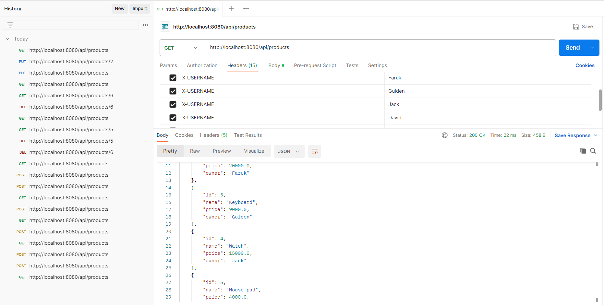

# Tax Calculator API

This project is a **Tax Calculator REST API** developed as part of the **Ayrotek Backend Coding Challenge**. It is built using **Spring Boot**.

## 🚀 Getting Started
Once the application is running, you can access the API at:
📍 'http://localhost:8080'

---

## 📚 API Endpoints

### 🔹 `POST /api/products`
Creates a new product.  
**Header:** `X-USERNAME` (Required to specify the product owner)  
**Response:** `201 Created`

---

### 🔹 `GET /api/products`
Retrieves a list of all products.  
**Response:** `200 OK`

---

### 🔹 `PUT /api/products/{id}`
Updates **only your own product**.  
**Header:** `X-USERNAME` (Required for ownership verification)  
**Response:**  
- `200 OK` → Successfully updated  
- `403 Forbidden` → Unauthorized action

---

### 🔹 `DELETE /api/products/{id}`
Deletes **only your own product**.  
**Header:** `X-USERNAME` (Required for ownership verification)  
**Response:**  
- `200 OK` → Successfully deleted  
- `403 Forbidden` → Unauthorized action

---

### 🔹 `GET /api/products/{id}/calculate-tax`
Returns the tax amount for a specific product.  
**Response:**  
- `200 OK` → Tax data returned  
- `404 Not Found` → Product not found

---

> ### 🛠️ Developer Note:  
This project uses the `X-USERNAME` header to validate product ownership, ensuring that users can only manage their own products. This approach provides a secure and controlled API environment.

## 📸 Postman Test Results

>>>>>>> 012f95862d4ab96f194e99142bfdf80d3b9aeb9d

---

## 📞 Contact

**Muhammed Ali Aslan**  
Backend Developer  

📧 **Email:** [aslanalim0106@gmail.com](mailto:aslanalim0106@gmail.com)  
🔗 **LinkedIn:** [linkedin.com/in/ali-aslan-4202562a4](https://www.linkedin.com/in/ali-aslan-4202562a4)
